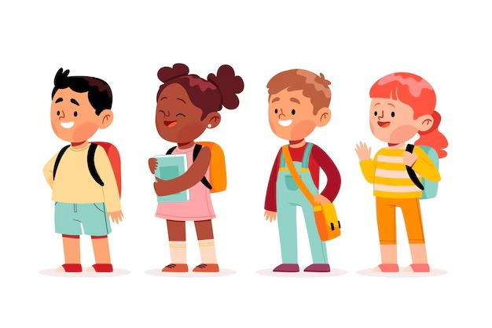

# KidsLearn2 : Plateforme Éducative Interactive pour Enfants 
  

**KidsLearn2** est une plateforme ludique conçue pour stimuler l'apprentissage des enfants à travers des outils adaptés, des jeux éducatifs et des activités créatives. Idéale pour les parents et enseignants !  

---

## Fonctionnalités Clés ✨  
- 🎮 **Jeux interactifs** pour apprendre en s'amusant.  
- 📖 **Ressources pédagogiques** adaptées à différents âges.  
- 🖌️ **Outils créatifs** (maths, etc.).  
- 👨‍👩‍👧‍👦 **Espace parents** pour suivre les progrès.  

---

## CONTRIBUTEURS ✨  
Un grand merci à l'équipe derrière ce projet :  
- **Hajar AitLakssir** (Groupe B)  
- **Sdour Aya** (Groupe A)  
- **Khadija El Idrissi El Mourabiti** (Groupe A)  

---

## Comment Contribuer ? 🤝  
1. Forkez le dépôt.  
2. Ajoutez vos améliorations (features, corrections, etc.).  
3. Soumettez une Pull Request !  
